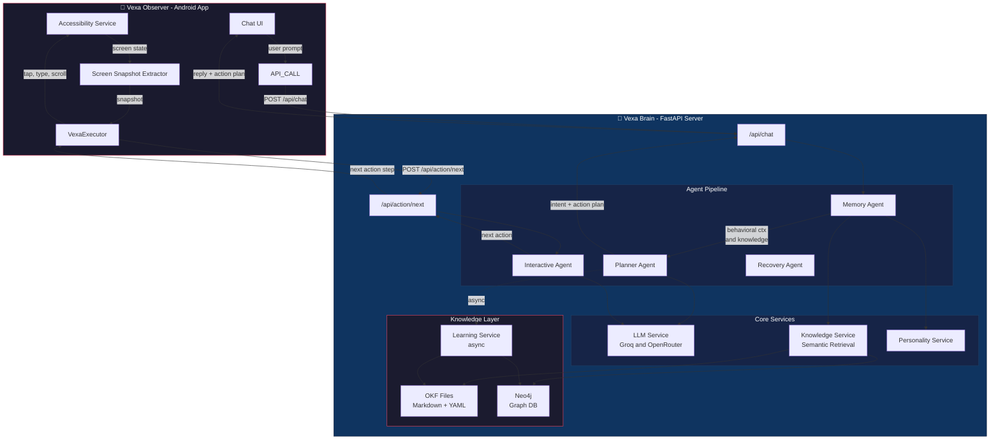

<p align="center">
  
</p>

<p align="center">
  <strong>Your personal AI brain that thinks, learns, and automates your Android phone.</strong>
</p>

<p align="center">
  <a href="#architecture">Architecture</a> •
  <a href="#features">Features</a> •
  <a href="#how-it-works">How It Works</a> •
  <a href="#tech-stack">Tech Stack</a> •
  <a href="#api-reference">API Reference</a> •
  <a href="#quick-start">Quick Start</a> •
  <a href="#live-demo">Live Demo</a>
</p>

<p align="center">
  
  
  
  
  
  
  
</p>

<!-- Live Demo Section -->
<p align="center">
  <!-- Replace with your actual demo GIF/video -->
  <!--  -->
  <!-- <br> -->
  <!-- <em>Live Demo: Vexa automates a LinkedIn post — from composing to publishing — entirely hands-free.</em> -->
</p>

---

## What is Vexa?

**Vexa** is a fully autonomous personal AI assistant built by [Brahma Vamsi](https://brahmavamsia.netlify.app). It consists of two tightly integrated components:

| Component                       | Description                                                                                                                                                     |
| ------------------------------- | --------------------------------------------------------------------------------------------------------------------------------------------------------------- |
| **Vexa Brain** (this repo)      | The AI thinking engine — a FastAPI server that understands intent, retrieves personal knowledge, plans phone actions, and learns from every conversation        |
| **Vexa Observer** (Android app) | The execution layer — captures screen state via Android Accessibility APIs, executes planned actions (tap, type, scroll), and reports results back to the Brain |

Together, they form a closed-loop system where the Brain **thinks** and the Observer **acts** — no human intervention needed for routine tasks.

---

<a id="features"></a>

## Key Highlights

- **Autonomous Phone Automation** — Executes multi-step workflows on Android: open apps, navigate UI, type text, scroll, and submit — all from a natural language instruction.
- **Self-Learning Knowledge Base** — Uses OKF (Open Knowledge Format) + Neo4j to store, retrieve, and continuously grow personal knowledge from every conversation.
- **Multi-Agent Architecture** — Four specialized agents (Memory, Planner, Interactive, Recovery) collaborate in a pipeline for robust task execution.
- **Context-Aware Confirmation** — Smart confirmation system: auto-proceeds on safe actions, asks once before publishing, always confirms payments/OTP.
- **Personalized Responses** — Learns communication style (including bilingual Telugu-English), adjusts tone by time of day and intent.
- **Resilient Execution** — Loop detection, evasive scrolling, auto-retry with fallback, and graceful error recovery.

---

<a id="architecture"></a>

## Architecture



### Request Flow

```
User: "Post about Vexa on LinkedIn"
  │
  ▼
┌─────────────────────────────────────────────────────────────┐
│  1. POST /api/chat                                          │
│     ├── MemoryAgent: fetch OKF knowledge + Neo4j context    │
│     ├── PlannerAgent: detect intent → generate 6-step plan  │
│     │   OPEN_APP → TAP compose → TYPE_TEXT → WAIT_FOR_USER  │
│     │   → TAP "Post" → DONE                                 │
│     └── LearningService: extract and store new facts async  │
│                                                             │
│  2. Android executes plan step-by-step:                     │
│     ├── For each step: POST /api/action/next                │
│     ├── InteractiveAgent: reads screen snapshot → decides   │
│     │   next action based on what is visible                │
│     ├── Smart confirmation: only asks once before publish   │
│     └── Loop detection: prevents stuck automation           │
│                                                             │
│  3. Result: LinkedIn post published autonomously            │
└─────────────────────────────────────────────────────────────┘
```

---

<a id="how-it-works"></a>

## How It Works

### Agent Pipeline

| Agent                 | Role                          | How It Works                                                                                                                        |
| --------------------- | ----------------------------- | ----------------------------------------------------------------------------------------------------------------------------------- |
| **Memory Agent**      | Context Assembly              | Queries OKF files + Neo4j for relevant personal knowledge, builds behavioral context from MongoDB, constructs personality prompt    |
| **Planner Agent**     | Intent Detection and Planning | Receives enriched context, LLM generates structured JSON: intent, confidence, natural reply, step-by-step action plan               |
| **Interactive Agent** | Real-Time Execution           | Receives live screen snapshots from Android, LLM decides the single best next action, handles unexpected screens, loops, and errors |
| **Recovery Agent**    | Error Recovery                | When a planned step fails after retries, takes over to find an alternative path using current screen state                          |

### Self-Learning Knowledge System (OKF)

Vexa's knowledge grows automatically from every conversation:

```
User says: "I just got 2 DSATs at work"
  │
  ▼
LearningService (runs async after response):
  ├── Extract: "Vamsi received 2 DSATs" (FACT_CAREER)
  ├── Classify: → memory/career_events.md
  ├── Deduplicate: check if fact already exists
  └── Merge: append to knowledge file with timestamp

Later, user asks: "How many DSATs do I have?"
  │
  ▼
KnowledgeService (retrieval pipeline):
  ├── Keyword extraction: ["dsat", "dsats"]
  ├── LLM semantic expansion: ["assessment", "score", "performance", ...]
  ├── Multi-signal scoring per section:
  │   ├── Heading keyword match    × 3.0 pts
  │   ├── Micro-fact keyword match × 3.0 pts
  │   ├── Tag match                × 1.5 pts
  │   ├── Content substring match  × 2.0 pts
  │   └── Frequency boost          × 0.5 pts/occurrence
  ├── Neo4j full-text fallback (if scores < threshold)
  └── Returns: "Vamsi has received 2 DSATs" ✓
```

### Knowledge Directory Structure

```
knowledge/
├── index.md                       # Master catalog
├── identity/
│   ├── personal.md                # Name, education, location
│   └── professional.md            # Skills, career, projects
├── preferences/
│   ├── communication.md           # Response style preferences
│   └── apps_and_tools.md          # App and workflow preferences
├── memory/
│   ├── career_events.md           # Job milestones, interviews
│   ├── conversations.md           # Important conversation insights
│   └── temporal.md                # Time-sensitive facts
├── speech/
│   └── profile.md                 # Speaking style, Telugu phrases
└── relationships/
    └── contacts.md                # Known people and context
```

### Smart Confirmation System

| Action Type   | Confirmation   | Example                                        |
| ------------- | -------------- | ---------------------------------------------- |
| Navigation    | Auto-proceed   | Opening apps, tapping compose, scrolling       |
| Content Entry | Auto-proceed   | Typing text, filling fields                    |
| Publishing    | Ask once       | Final Post/Send/Submit tap after content typed |
| Payments      | Always confirm | Purchases, transfers, bookings                 |
| OTP/Security  | Always confirm | Verification codes, password entry             |

---

<a id="tech-stack"></a>

## Tech Stack

| Layer                | Technology                             | Purpose                                          |
| -------------------- | -------------------------------------- | ------------------------------------------------ |
| **API Server**       | FastAPI (async Python)                 | REST API with automatic validation               |
| **LLM Inference**    | Groq (primary) + OpenRouter (fallback) | Multi-model with cascading fallback (10+ models) |
| **Knowledge Store**  | OKF (Markdown + YAML frontmatter)      | Structured, file-based personal knowledge        |
| **Graph Database**   | Neo4j (Aura)                           | Full-text search fallback + relationship mapping |
| **Behavioral Data**  | MongoDB (Motor async)                  | Phone usage patterns, app sessions               |
| **Android Executor** | Kotlin + Accessibility APIs            | Screen reading, UI interaction, overlay system   |
| **Deployment**       | Docker / Render                        | Container-based cloud hosting                    |
| **Observability**    | LangSmith                              | LLM trace logging and debugging                  |

---

<a id="api-reference"></a>

## API Reference

### Core Endpoints

| Method | Path                  | Description                                        |
| ------ | --------------------- | -------------------------------------------------- |
| `POST` | `/api/chat`           | Main brain endpoint: prompt to reply + action plan |
| `POST` | `/api/action/next`    | Interactive step execution from screen snapshot    |
| `POST` | `/api/action/recover` | Recovery from failed action steps                  |
| `GET`  | `/api/health`         | Health check                                       |

### Knowledge Endpoints

| Method | Path                         | Description               |
| ------ | ---------------------------- | ------------------------- |
| `GET`  | `/api/knowledge/stats`       | Knowledge base statistics |
| `GET`  | `/api/knowledge/tags`        | All indexed tags          |
| `GET`  | `/api/knowledge/query?q=...` | Test knowledge retrieval  |

### Example: Chat Request

```json
{
  "userId": "local_user",
  "prompt": "Post about Vexa on LinkedIn",
  "conversationHistory": [
    { "role": "user", "content": "previous message" },
    { "role": "assistant", "content": "previous reply" }
  ]
}
```

### Example: Chat Response

```json
{
  "reply": "On it — opening LinkedIn and drafting a post about Vexa.",
  "isAction": true,
  "actionPlan": {
    "planId": "abc-123",
    "userPrompt": "Post about Vexa on LinkedIn",
    "intent": "OTHER",
    "confidence": 0.95,
    "actions": [
      {
        "step": 1,
        "type": "OPEN_APP",
        "params": { "packageName": "com.linkedin.android" },
        "description": "Open LinkedIn"
      },
      {
        "step": 2,
        "type": "TAP_ELEMENT",
        "params": { "text": "Post" },
        "description": "Tap compose button"
      },
      {
        "step": 3,
        "type": "TYPE_TEXT",
        "params": { "text": "Introducing Vexa..." },
        "description": "Type post content"
      },
      {
        "step": 4,
        "type": "WAIT_FOR_USER",
        "params": { "message": "Review post before publishing" },
        "description": "User confirmation"
      },
      {
        "step": 5,
        "type": "TAP_ELEMENT",
        "params": { "text": "Post" },
        "description": "Publish",
        "requiresConfirmation": true
      }
    ]
  }
}
```

---

<a id="quick-start"></a>

## Quick Start

### Prerequisites

- Python 3.11+
- Neo4j Aura account (free tier works)
- Groq API key (free tier: 100k tokens/day)
- OpenRouter API key (optional, for fallback)

### Setup

```bash
# 1. Clone and navigate
git clone https://github.com/abvinnovator/Vexa_Brain.git
cd Vexa_Brain/vexa-brain

# 2. Create virtual environment
python -m venv venv
source venv/bin/activate  # or venv\Scripts\activate on Windows

# 3. Install dependencies
pip install -r requirements.txt

# 4. Configure environment
cp .env.example .env
# Edit .env with your API keys

# 5. Run
python main.py
# Server starts at http://0.0.0.0:8000
```

---

<a id="live-demo"></a>

## Live Demo

<!--
Add your demo content here:
- Screen recordings of LinkedIn posting flow
- Screenshots of the chat interface
- Video of end-to-end automation
-->

<p align="center">
  <em>Live demo coming soon — recording the full LinkedIn posting automation flow.</em>
</p>

<!-- Example format for when you have content:
<table width="100%">
  <tr>
    <td width="50%" align="center">
      <b>1. User Prompt</b><br>
      <sub>Ask Vexa to post on LinkedIn</sub><br><br>
      
    </td>
    <td width="50%" align="center">
      <b>2. Autonomous Execution</b><br>
      <sub>App opens LinkedIn, types content, confirms</sub><br><br>
      
    </td>
  </tr>
</table>
-->

---

## Project Structure

```
vexa-brain/
├── main.py                    # FastAPI server entry point
├── config.py                  # Environment configuration
├── agents/
│   ├── memory_agent.py        # Context assembly from all sources
│   ├── planner_agent.py       # Intent detection + action planning
│   ├── interactive_agent.py   # Real-time step-by-step execution
│   └── recovery_agent.py      # Error recovery and fallback
├── services/
│   ├── llm_service.py         # Multi-provider LLM with cascading fallback
│   ├── knowledge_service.py   # OKF retrieval + semantic search
│   ├── neo4j_service.py       # Graph database operations
│   ├── learning_service.py    # Async fact extraction + knowledge growth
│   ├── personality_service.py # Communication style matching
│   └── mongo_service.py       # Behavioral data queries
├── models/
│   └── request_models.py      # Pydantic request/response schemas
├── routers/
│   ├── chat.py                # /api/chat endpoint
│   ├── action.py              # /api/action/* endpoints
│   ├── agent.py               # /api/agent/* endpoints
│   └── knowledge.py           # /api/knowledge/* endpoints
├── knowledge/                 # OKF knowledge files (auto-growing)
├── docs/
│   ├── ARCHITECTURE.md        # Detailed architecture documentation
│   └── DEPLOYMENT.md          # Deployment guide
├── requirements.txt
├── Dockerfile
└── render.yaml                # Render deployment config
```

---

## Future Roadmap

- [ ] **Voice Assistant Integration** — Connect to Vexa voice pipeline for hands-free operation
- [ ] **Google Drive Integration** — Search and retrieve files with OAuth2
- [ ] **RAG Layer** — Pinecone/ChromaDB for large-corpus semantic search
- [ ] **Multi-User Support** — Per-user knowledge directories
- [ ] **Knowledge Decay** — Auto-archive facts not referenced in 90+ days
- [ ] **Chrome Extension** — Web-based task automation companion

---

<p align="center">
  Built with care by <a href="https://brahmavamsia.netlify.app">Brahma Vamsi</a>
</p>
